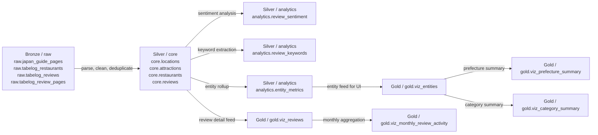

# TripSage Medallion Schema Reference (Bronze, Silver, Gold)

This document describes the PostgreSQL bronze, silver, and gold schema contract prepared for pipeline and dashboard consumption.

Source SQL definition:
- sql/admin/01_setup_schema.sql

## Scope

TripSage follows medallion layering:
- Bronze (`raw`): source-fidelity ingestion storage
- Silver (`core` + `analytics`): normalized business entities and advanced analytics outputs
- Gold (`gold`): curated dashboard-ready views

Gold views are designed as a stable data contract for the visualisation layer. They provide:
- Unified entity records (food + attractions)
- Sentiment label and recommendation score at entity level
- Review-level records for trend analysis
- Prefecture and category summary views

Advanced analytics in silver support the project scope from proposal/progress report:
- Sentiment analysis on reviews
- Keyword extraction from reviews
- Entity-level aggregate metrics for downstream gold views

## Naming Convention

Schemas:
- `raw` (bronze)
- `core` (silver normalized)
- `analytics` (silver advanced analytics)
- `gold` (gold)

## Bronze Schema (raw)

Purpose:
- Store raw crawled content and ingestion metadata for traceability, auditing, and reprocessing.

Tables:
- `raw.japan_guide_pages`
- `raw.tabelog_restaurants`
- `raw.tabelog_reviews`
- `raw.tabelog_review_pages`

### raw.japan_guide_pages

Grain:
- One row per crawled Japan-Guide page URL.

Columns:
- `id` (bigserial, PK)
- `url` (text, unique, not null)
- `page_type` (varchar(50))
- `title` (text)
- `raw_html` (text)
- `scraped_at` (timestamp, default current_timestamp)
- `status` (varchar(20), default `SUCCESS`)
- `error_message` (text)

### raw.tabelog_restaurants

Grain:
- One row per crawled Tabelog restaurant page URL.

Columns:
- `id` (bigserial, PK)
- `url` (text, unique, not null)
- `raw_html` (text)
- `scraped_at` (timestamp, default current_timestamp)
- `status` (varchar(20), default `SUCCESS`)
- `error_message` (text)

### raw.tabelog_reviews

Grain:
- One row per raw review record per restaurant URL and source review id.

Columns:
- `id` (bigserial, PK)
- `restaurant_url` (text, not null)
- `review_id` (text, not null)
- `reviewer_name` (text)
- `review_text` (text)
- `rating` (numeric(2,1))
- `review_date` (date)
- `scraped_at` (timestamp, default current_timestamp)

Constraint:
- Unique key: (`restaurant_url`, `review_id`)

### raw.tabelog_review_pages

Grain:
- One row per crawled review page URL.

Columns:
- `id` (bigserial, PK)
- `url` (text, unique)
- `raw_html` (text)
- `scraped_at` (timestamp, default current_timestamp)
- `status` (varchar(20))
- `error_message` (text)

## Silver Schema (core)

Purpose:
- Store cleaned and normalized business entities used by analytics and gold views.

Tables:
- `core.locations`
- `core.attractions`
- `core.restaurants`
- `core.reviews`

### core.locations

Grain:
- One row per normalized location name.

Columns:
- `id` (serial, PK)
- `country` (varchar(100), default `Japan`)
- `prefecture` (varchar(100))
- `city` (varchar(100))
- `district` (varchar(100))
- `latitude` (numeric(9,6))
- `longitude` (numeric(9,6))
- `name` (text, unique, not null)
- `created_at` (timestamp, default current_timestamp)

### core.attractions

Grain:
- One row per normalized attraction source URL.

Columns:
- `id` (serial, PK)
- `name` (text, not null)
- `description` (text)
- `category` (varchar(100))
- `keywords` (varchar(1000))
- `location_id` (int, FK to `core.locations.id`)
- `average_rating` (numeric(2,1))
- `review_count` (int)
- `source_url` (text, unique)
- `google_map_url` (varchar(1000))
- `created_at` (timestamp, default current_timestamp)

### core.restaurants

Grain:
- One row per normalized restaurant source URL.

Columns:
- `id` (serial, PK)
- `name` (text, not null)
- `category` (varchar(100))
- `price_range` (varchar(50))
- `tabelog_rating` (numeric(2,1))
- `review_count` (int)
- `location_id` (int, FK to `core.locations.id`)
- `source_url` (text, unique)
- `created_at` (timestamp, default current_timestamp)

### core.reviews

Grain:
- One row per normalized review id under entity scope.

Columns:
- `id` (serial, PK)
- `entity_type` (varchar(20))
- `entity_id` (int)
- `source_review_id` (text)
- `reviewer_name` (text)
- `rating` (numeric(2,1))
- `review_text` (text)
- `review_date` (date)
- `language` (varchar(20))
- `created_at` (timestamp, default current_timestamp)

Constraint:
- Unique key: (`entity_type`, `entity_id`, `source_review_id`)

Indexes used downstream:
- `idx_reviews_entity` on (`entity_type`, `entity_id`)
- `idx_reviews_review_date` on (`review_date`)

## Silver Analytics Schema (analytics)

Purpose:
- Store enrichment outputs from advanced analytics, including sentiment analysis, keyword extraction, and entity-level rollups.

Tables:
- `analytics.review_sentiment`
- `analytics.review_keywords`
- `analytics.entity_metrics`

### analytics.review_sentiment

Grain:
- One row per review in `core.reviews`.

Columns:
- `review_id` (int, PK, FK to `core.reviews.id`)
- `sentiment_score` (numeric(4,3))
- `sentiment_label` (varchar(20))
- `processed_at` (timestamp, default current_timestamp)

Usage:
- Fine-grained sentiment output for future drilldown and model QA.

### analytics.review_keywords

Grain:
- One row per extracted keyword per review.

Columns:
- `id` (serial, PK)
- `review_id` (int, FK to `core.reviews.id`)
- `keyword` (text)
- `frequency` (int, default 1)

Usage:
- Keyword extraction output from review text.
- Enables word/term analytics (top keywords, keyword heatmaps, category keyword patterns).

### analytics.entity_metrics

Grain:
- One row per (`entity_type`, `entity_id`) aggregate metric snapshot.

Columns:
- `id` (serial, PK)
- `entity_type` (varchar(20))
- `entity_id` (int)
- `avg_sentiment` (numeric(4,3))
- `positive_ratio` (numeric(5,2))
- `total_reviews` (int)
- `last_updated` (timestamp, default current_timestamp)

Usage:
- Primary aggregate feed for gold scoring and sentiment label derivation in `gold.viz_entities`.

## Gold Schema (gold)

Views:
- `gold.viz_entities`
- `gold.viz_reviews`
- `gold.viz_prefecture_summary`
- `gold.viz_category_summary`
- `gold.viz_monthly_review_activity`

## 1) gold.viz_entities

Purpose:
- Main entity feed for filters, recommendation ranking, and listing tables.

Grain:
- One row per entity (restaurant or attraction).

Columns:
- `entity_type` (text): `food` or `attraction`
- `entity_id` (int): source entity key in core table
- `name` (text)
- `category` (text)
- `prefecture` (text)
- `city` (text)
- `location_name` (text)
- `rating` (numeric): `tabelog_rating` for food, `average_rating` for attraction
- `review_count` (int)
- `source_url` (text)
- `avg_sentiment` (numeric, nullable): from `analytics.entity_metrics`
- `sentiment_label` (text): derived label
- `recommendation_score` (numeric): 0-100 score for ranking

Business logic:
- `sentiment_label` precedence:
  1. If `avg_sentiment` exists:
     - `>= 0.200` => `Positive`
     - `<= -0.200` => `Negative`
     - otherwise => `Neutral`
  2. If no `avg_sentiment`, fallback to rating:
     - `rating >= 4.0` => `Positive`
     - `rating >= 3.0` => `Neutral`
     - otherwise => `Negative`
- `recommendation_score` formula:
  - `((rating/5)*0.70 + (least(review_count,500)/500)*0.30) * 100`

## 2) gold.viz_reviews

Purpose:
- Detail-level review feed for time trend and review analytics.

Grain:
- One row per review in `core.reviews`.

Columns:
- `review_id` (int)
- `entity_type` (text): `restaurant` or `attraction` (from core.reviews)
- `entity_id` (int)
- `review_date` (date)
- `rating` (numeric)
- `review_text` (text)
- `language` (text)
- `source_url` (text, nullable): joined from core entity table by `entity_type/entity_id`

Notes:
- This view uses `entity_type='restaurant'` to map to `core.restaurants`.
- `viz_entities` outputs `food` for UI friendliness.

## 3) gold.viz_prefecture_summary

Purpose:
- Fast aggregation for prefecture-level KPIs/charts.

Grain:
- One row per (`prefecture`, `entity_type`).

Columns:
- `prefecture` (text)
- `entity_type` (text)
- `entity_count` (int)
- `avg_rating` (numeric, 2 d.p.)
- `total_reviews` (int)
- `avg_recommendation_score` (numeric, 2 d.p.)

## 4) gold.viz_category_summary

Purpose:
- Category-level breakdown for charting and comparisons.

Grain:
- One row per (`entity_type`, `category`).

Columns:
- `entity_type` (text)
- `category` (text)
- `entity_count` (int)
- `avg_rating` (numeric, 2 d.p.)
- `total_reviews` (int)
- `avg_recommendation_score` (numeric, 2 d.p.)

## 5) gold.viz_monthly_review_activity

Purpose:
- Monthly time-series for review volume and average rating trends.

Grain:
- One row per (`month_start`, `entity_type`).

Columns:
- `month_start` (date): first day of month
- `entity_type` (text)
- `review_count` (int)
- `avg_rating` (numeric, 2 d.p.)

## Example Queries

Main dashboard list:

```sql
SELECT *
FROM gold.viz_entities
ORDER BY recommendation_score DESC, rating DESC, review_count DESC
LIMIT 50;
```

Prefecture chart:

```sql
SELECT prefecture, entity_type, entity_count, avg_rating
FROM gold.viz_prefecture_summary
ORDER BY entity_count DESC;
```

Category chart:

```sql
SELECT entity_type, category, entity_count, avg_recommendation_score
FROM gold.viz_category_summary
ORDER BY entity_count DESC;
```

Monthly trend:

```sql
SELECT month_start, entity_type, review_count, avg_rating
FROM gold.viz_monthly_review_activity
ORDER BY month_start, entity_type;
```

## Data Contract Notes for Visualisation Team

- Use `gold.viz_entities` as primary source for filters and ranking.
- Use `gold.viz_monthly_review_activity` for time series (avoid recomputing from detail on the UI).
- Treat `avg_sentiment` as optional (nullable); rely on `sentiment_label` for display.
- `source_url` can be null in rare unmatched cases; UI should handle empty links gracefully.

## Refresh/Deployment

The views are created by running:

```sql
-- run in PostgreSQL
\i sql/admin/01_setup_schema.sql
```

If schemas/tables already exist, definitions are safely re-applied with `IF NOT EXISTS` and `CREATE OR REPLACE VIEW`.

## Data Schema Transformation

This is the compressed table-level flow for the whole pipeline.



Table-level mapping:

| From | Transformation | To |
|---|---|---|
| `raw.japan_guide_pages` | parse page HTML, extract title/description/location fields | `core.attractions`, `core.locations` |
| `raw.tabelog_restaurants` | parse restaurant HTML, normalize restaurant metadata | `core.restaurants`, `core.locations` |
| `raw.tabelog_reviews` | normalize review text, rating, date, source id | `core.reviews` |
| `core.reviews` | sentiment analysis | `analytics.review_sentiment` |
| `core.reviews` | keyword extraction | `analytics.review_keywords` |
| `core.reviews` + `core.attractions/restaurants` | entity-level aggregation | `analytics.entity_metrics` |
| `core.*` + `analytics.entity_metrics` | curate dashboard entity feed | `gold.viz_entities` |
| `core.reviews` | expose review detail for trend analysis | `gold.viz_reviews` |
| `gold.viz_entities` | group by prefecture | `gold.viz_prefecture_summary` |
| `gold.viz_entities` | group by category | `gold.viz_category_summary` |
| `gold.viz_reviews` | group by month | `gold.viz_monthly_review_activity` |

Use this compressed flow when presenting the schema to teammates:
bronze captures raw data, silver normalizes and enriches it, and gold exposes ready-to-use dashboard views.
